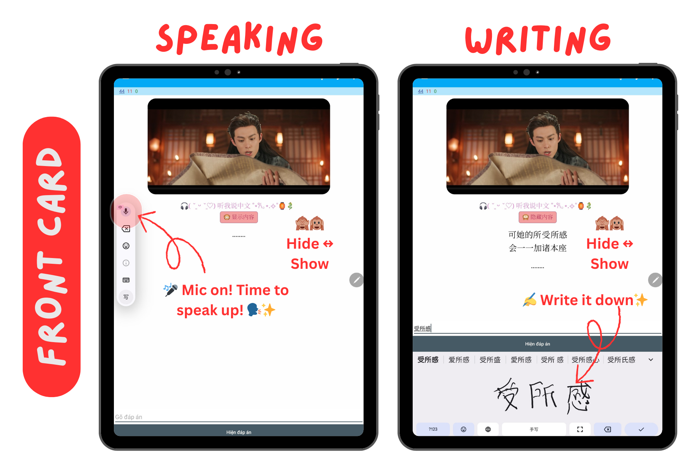
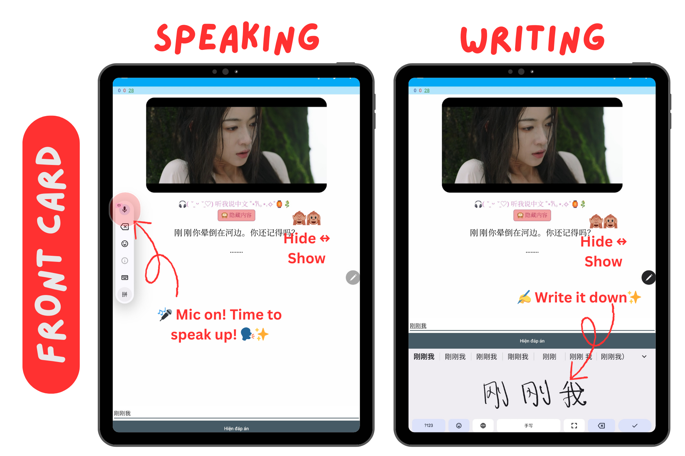

# 🐉 Anki Chinese Flashcards 

### 📂 Explore on [GitHub](https://github.com/GLASSY-GAIA/netflix-series-anki-mandarin-zh/tree/main)

Learn Mandarin through Chinese Drama Series! This deck is packed with drama screenshots, original audio, and multilingual subtitles—perfect for leveling up all 4 skills: 👂🗣✍️📖  

🎯 **Target Learner**: Upper-Intermediate to Advanced (HSK4–HSK8)

---

## ✨ Features  
- 🎤 **Speak & Write**: Answer with mic 🎙 or handwriting/keyboard ✍️. Toggle answer anytime (**H** on desktop).  
- 🎧 **Strong Anchors**: Screenshots + original audio = instant recall.  
- 🌍 **Subtitles**: Tiếng Việt *(default)*, English, 한국어, ไทย, 中文(简体), 中文(繁體).  
- 📚 **Highlights**: Key words, grammar points, phrases with EN + VI notes.  
- 🌀 **Story Flow**: Cards follow the drama’s storyline = context-driven learning ✨  

**Legend**:  
- 🇻🇳 Vietnamese | 🇬🇧 English | 🇰🇷 Korean | 🇹🇭 Thai | 🇨🇳简 Simplified Chinese | 🇨🇳繁 Traditional Chinese | 🇪🇸 (LatAm) Spanish (Latin America) | 🇪🇸 (ES) Spanish (Spain) | 🇯🇵 Japanese
---

## 🌟 Why This Deck Works  
- Chronological order = drama becomes your memory palace 🎬  
- Vocabulary appears in **natural sentences**, not random lists 💡  
- Active recall + context = stronger retention 🎯  
- Train all 4 skills in every card 👂🗣✍️📖  

---

## 🚀 How to Use  

**Front Card**  
1. 🎧 Listen carefully (replay freely).  
2. 💬 Speak OR ✍️ Write the line (whole sentence or target words).  
3. 👀 Stuck? Press **H** to reveal hints/answer.  

**Back Card**  
1. 📖 Check Mandarin subtitle + your chosen translation (or hide for immersion).  
2. 🎯 Review highlighted words/grammar (with VN/EN explanations).  
3. 🎧 Replay + shadow for fluency ▶️  

*🔖 **Note**: Filter cards by difficulty HSK2–HSK9 via tags.*  

---

## Love between Fairy and Devil 🌜
**Source**: [Netflix](https://www.netflix.com/title/81622849)

| Episode | Level | Anki Deck | Subtitles | Availability |  
|---------|-----------|-----------|--------|------------|
| Ep.1 | HSK4-HSK5 | [Anki Deck Link](#) |  🇻🇳 🇬🇧 🇰🇷 🇹🇭 🇨🇳简 🇨🇳繁 | ✅ 27th Sep, 2025 |  
| Ep.2 |HSK4-HSK5 | [Anki Deck Link](#) | 🇻🇳 🇬🇧 🇰🇷 🇹🇭 🇨🇳简 🇨🇳繁 | ✅ 27th Sep, 2025 |  
| Ep.3 | HSK5 |[Anki Deck Link](#) | 🇻🇳 🇬🇧 🇰🇷 🇹🇭 🇨🇳简 🇨🇳繁 |  ✅ 27th Sep, 2025 |  
| Ep.4 | HSK5 | [Anki Deck Link](#) | 🇻🇳 🇬🇧 🇰🇷 🇹🇭 🇨🇳简 🇨🇳繁 |  ✅ 27th Sep, 2025  |  
| Ep.5 | (TBU) |[Anki Deck Link](#) | 🇻🇳 🇬🇧 🇰🇷 🇹🇭 🇨🇳简 🇨🇳繁 | 🔜 Coming Soon | 

---
## The Double °‧🌱⋆.ೃ࿔*:･
**Source**: [Netflix](https://www.netflix.com/vn-en/title/81900131)

| Episode | Level | Anki Deck | Subtitles | Availability |  
|---------|-----------|-----------|--------|------------|
| Ep.1 | HSK5-HSK6 | [Anki Deck Link](#) |  🇻🇳 🇬🇧 🇪🇸 (LatAm) 🇨🇳简 🇨🇳繁 | 🔜 Coming Soon |  
| Ep.2 |HSK5-HSK6 | [Anki Deck Link](#) | 🇻🇳 🇬🇧 🇪🇸 (LatAm) 🇨🇳简 🇨🇳繁 | 🔜 Coming Soon |  
| Ep.3 | HSK5-HSK6 |[Anki Deck Link](#) | 🇻🇳 🇬🇧 🇪🇸 (LatAm) 🇨🇳简 🇨🇳繁 |  🔜 Coming Soon|  
| Ep.4 | HSK5-HSK6 | [Anki Deck Link](#) | 🇻🇳 🇬🇧 🇪🇸 (LatAm) 🇨🇳简 🇨🇳繁 |  🔜 Coming Soon |  
| Ep.5 | (TBU) |[Anki Deck Link](#) | 🇻🇳 🇬🇧 🇪🇸 (LatAm) 🇨🇳简 🇨🇳繁 | 🔜 Coming Soon | 

---

## ❓ FAQ  

- 🎙️📝 [How to set up language, mic & writing panel (Desktop / Android)](https://noiseless-abacus-7a5.notion.site/GLASSY-GAIA-Anki-Japanese-Movie-Flashcards-FAQ-278b88c26c408083a429cf3ed5f30e64#278b88c26c40807d97cbe7f6b006a55b)  
- 🗣️✍️ [How to practice speaking & writing effectively with this deck](https://noiseless-abacus-7a5.notion.site/GLASSY-GAIA-Anki-Japanese-Movie-Flashcards-FAQ-278b88c26c408083a429cf3ed5f30e64#278b88c26c408095b81ee66a37728c04)  
- 🌐🎞️ [How to adjust subtitles to your preferred language](https://noiseless-abacus-7a5.notion.site/GLASSY-GAIA-Anki-Japanese-Movie-Flashcards-FAQ-278b88c26c408083a429cf3ed5f30e64#278b88c26c40808ea088d3d7543fa043)  
- 🪧 Got more questions? Drop them in the comments!  

---

💖 Happy Learning ₍₍⚞(˶˃ ꒳ ˂˶)⚟⁾⁾  

If you enjoy this deck, please consider giving it a ⭐ on GitHub! ✨  
